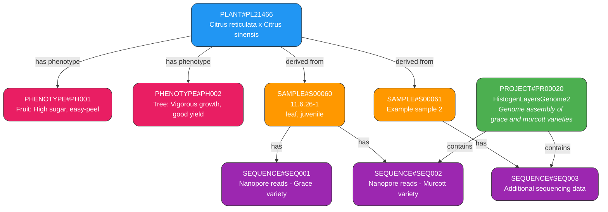

## diagram

```mermaid

graph TD
    %% Top Level - Plant
    Plant[PLANT#PL21466<br/>Citrus reticulata x Citrus sinensis]

    %% Phenotypes for the Plant
    Plant -->|has phenotype| Pheno1[PHENOTYPE#PH001<br/>Fruit: High sugar, easy-peel]
    Plant -->|has phenotype| Pheno2[PHENOTYPE#PH002<br/>Tree: Vigorous growth, good yield]

    %% Samples derived from Plant
    Plant -->|derived from| Sample1[SAMPLE#S00060<br/>11.6.26-1<br/>leaf, juvenile]
    Plant -->|derived from| Sample2[SAMPLE#S00061<br/>Example sample 2]

    %% Sample → Sequences
    Sample1 -->|has| Seq1[SEQUENCE#SEQ001<br/>Nanopore reads - Grace variety]
    Sample1 -->|has| Seq2[SEQUENCE#SEQ002<br/>Nanopore reads - Murcott variety]

    Sample2 -->|has| Seq3[SEQUENCE#SEQ003<br/>Additional sequencing data]

    %% Project at bottom
    Project[PROJECT#PR00020<br/>HistogenLayersGenome2<br/><i>Genome assembly of grace and murcott varieties</i>]
    
    Project -->|contains| Seq2
    Project -->|contains| Seq3

    classDef project fill:#4CAF50,stroke:#333,color:white,rx:15,ry:15;
    classDef plant fill:#2196F3,stroke:#333,color:white,rx:15,ry:15;
    classDef sample fill:#FF9800,stroke:#333,color:white,rx:15,ry:15;
    classDef sequence fill:#9C27B0,stroke:#333,color:white,rx:15,ry:15;
    classDef phenotype fill:#E91E63,stroke:#333,color:white,rx:15,ry:15;

    class Project project;
    class Plant plant;
    class Sample1,Sample2 sample;
    class Seq1,Seq2,Seq3 sequence;
    class Pheno1,Pheno2 phenotype;


```
