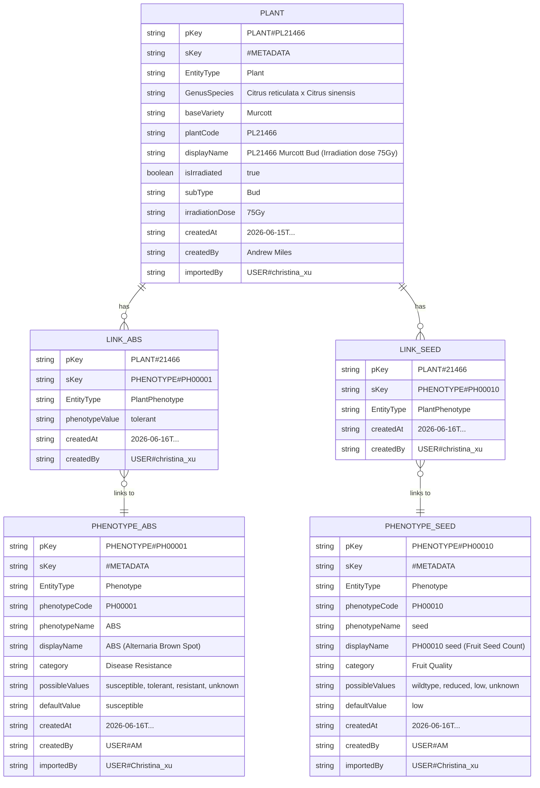

## Overview
This page is used to design Plant item. the values of plant1 and plant2 extracted from excel. These items will be linked to sample item. <Details>

| #  | baseVariety | plantCode | subType     | isIrradiated | irradiationDose | Suggested displayName                              | Original Entry |
|----|-------------|------------|-------------|--------------|-----------------|----------------------------------------------------|----------------|
| 1  | Murcott     | 21465      | Bud         | true         | -               | 21465 Murcott (irradiated bud)                     | 21465 (irradiated Murcott bud) |
| 2  | Daisy       | -          | -           | false        | -               | Daisy                                              | Daisy |
| 3  | Fortune     | -          | -           | false        | -               | Fortune                                            | Fortune |
| 4  | Grace       | -          | Seed        | true         | -               | Grace (irradiated seed)                            | Grace (irradiated seed) |
| 5  | Grace       | -          | Seed        | false        | -               | Grace (seed)                                       | Grace (seed) |
| 6  | Grace       | -          | Mother      | false        | -               | Grace Mother                                       | Grace Mother |
| 7  | Grace       | -          | Seedling    | false        | -               | Grace seedling                                     | Grace seedling |
| 8  | Minneola    | -          | -           | false        | -               | Minneola                                           | Minneola |
| 9  | Murcott     | -          | -           | false        | -               | Murcott                                            | Murcott |
| 10 | Murcott     | -          | Bud         | true         | -               | Murcott (irradiated bud)                           | Murcott (irradiated bud) |
| 11 | Murcott     | -          | Bud         | true         | 35Gy            | Murcott (irradiated bud) 35Gy                      | Murcott (irradiated bud) Irradiation dose 35Gy |
| 12 | Murcott     | -          | Bud         | true         | 45Gy            | Murcott (irradiated bud) 45Gy                      | Murcott (irradiated bud) Irradiation dose 45Gy |
| 13 | Murcott     | -          | Bud         | true         | 55Gy            | Murcott (irradiated bud) 55Gy                      | Murcott (irradiated bud) Irradiation dose 55Gy |
| 14 | Murcott     | -          | Bud         | true         | 65Gy            | Murcott (irradiated bud) 65Gy                      | Murcott (irradiated bud) Irradiation dose 65Gy |
| 15 | Murcott     | -          | Bud         | true         | 75Gy            | Murcott (irradiated bud) 75Gy                      | Murcott (irradiated bud) Irradiation dose 75Gy |
| 16 | Murcott     | -          | Seed        | true         | -               | Murcott (irradiated seed)                          | Murcott (irradiated seed) |
| 17 | Murcott     | -          | -  | true         | -               | Murcott (irradiated)                               | Murcott (irradiated) |
| 18 | Nova        | -          | -           | false        | -               | Nova                                               | Nova |
| 19 | Phoenix     | -          | Bud         | true         | -               | Phoenix (Irradiated bud)                           | Phoenix (Irradiated bud) |
| 20 | Phoenix     | -          | Seed        | true         | -               | Phoenix (irradiated seed)                          | Phoenix (irradiated seed) |
| 21 | Murcott     | -          | Wild Type   | false        | -               | WT Murcott                                         | WT Murcott |

 </Details>
 
## diagram




## items
around 20 items will be created, each items with compulsary attributes, eg.

- Plant item for "Murcott (irradiated bud)	Irradiation dose 75Gy", (assume code is 21466)

```
{
  "pKey": "PLANT#PL21466", 
  "sKey": "#METADATA",
  "EntityType": "Plant",
  "GenusSpecies":"Citrus reticulata x Citrus sinensis"
  
  "baseVariety": "Murcott",
  "plantCode": "PL21466",
  "displayName": "PL21466 Murcott Bud (Irradiation dose 75Gy)",
  "isIrradiated": true,
  "subType": "Bud",
  "irradiationDose": "75Gy"

  "createdAt": "2026-06-15T...",
  "createdBy": "Andrew Miles",
  "importedBy": "USER#christina_xu"

}
```
- Plant item for "Grace Mother" missing plantCode, createdBy, isIrradiated etc. But it is ok in DDB
<Details>
  
  ```
  {
    "pKey": "PLANT#Grace#Mother",
    "sKey": "#METADATA",
    "EntityType": "Plant",
    "GenusSpecies/taxon":"Citrus reticulata x Citrus sinensis"
    "baseVariety": "Grace",
    "displayName": "Grace Mother",
    "subType": "Mother"
    "importedBy": "USER#christina_xu"
  }
  ```

</Details>

## link items
assume PLANT#PL21466 have two phenotype: 
- Link 1: Plant → ABS Phenotype
  ```
    {
      "pKey": "PLANT#21466",
      "sKey": "PHENOTYPE#PH00001",
      "EntityType": "PlantPhenotype",
      "phenotypeValue": "tolerant",
      "displayName": "ABS (Alternaria Brown Spot)",
      "createdAt": "2026-06-16T...",
      "createdBy": "USER#christina_xu"
    }
  ```
- Link 2: Plant → Seed Phenotype
  ```
    {
        "pKey": "PLANT#21466",
        "sKey": "PHENOTYPE#PH00010",
        "EntityType": "PlantPhenotype",
        "relationshipType": "hasPhenotype",
        "createdAt": "2026-06-16T...",
        "createdBy": "USER#christina_xu"
    }
  ```
  - QUery: Get Plant + All its Phenotypes
  ```
    response = table.query(
        KeyConditionExpression="pKey = :pk AND begins_with(sKey, :prefix)",
        ExpressionAttributeValues={
            ":pk": "PLANT#21466",
            ":prefix": "PHENOTYPE#"
        }
    )
  ```
  it will return
  ```
    {
      "Items": [
        { "pKey": "PLANT#21466", "sKey": "#METADATA", "EntityType": "Plant", ... },           // The Plant itself
        { "pKey": "PLANT#21466", "sKey": "PHENOTYPE#PH00001", "EntityType": "PlantPhenotype", "phenotypeValue": "tolerant", ... },
        { "pKey": "PLANT#21466", "sKey": "PHENOTYPE#PH00010", "EntityType": "PlantPhenotype", "phenotypeValue": "low", ... }
      ]
    }
  ```

  ## Denormalization
  above query only returns the plant details and the relationship details; You do NOT get the full Phenotype definition (e.g. possibleValues, category, etc.) in this query. Here you can store the most often quried information in the linked item called denormalize, hence you don't need do a `BatchGetItem` to fetch full phenotype items. Denormalization should be automatic to avoid typos and keep data consistent. <Details>
  ```
    def link_plant_to_phenotype(plant_id: str, phenotype_id: str, phenotype_value: str):
      # Step 1: Get full Phenotype details
      phenotype = table.get_item(
          Key={"pKey": f"PHENOTYPE#{phenotype_id}", "sKey": "#METADATA"}
      )['Item']
      
      # Step 2: Create relationship item with denormalized data
      link_item = {
          "pKey": f"PLANT#{plant_id}",
          "sKey": f"PHENOTYPE#{phenotype_id}",
          "EntityType": "PlantPhenotype",
          
          "phenotypeValue": phenotype_value,
          
          # Denormalized fields (copied automatically)
          "phenotypeName": phenotype.get("phenotypeName"),
          "displayName": phenotype.get("displayName"),
          "category": phenotype.get("category"),
          
          "createdAt": "2026-06-16T...",
          "createdBy": "USER#christina_xu"
      }
      
      table.put_item(Item=link_item)
      print(f"Linked Plant {plant_id} to Phenotype {phenotype_id} with value '{phenotype_value}'")
  ```
</Details>
