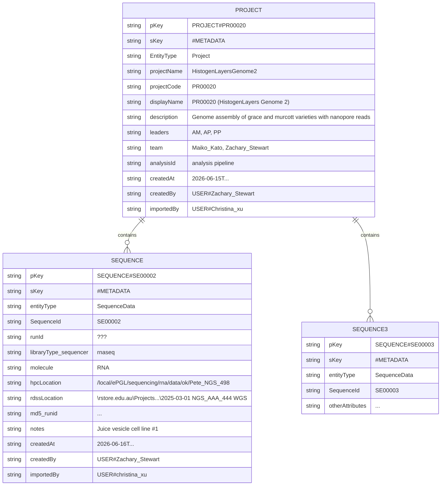

### Project List
- so far there are about25 projects:

| project_leaders | project_investigators | project_id                  | project_details |
|-----------------|-----------------------|-----------------------------|-----------------|
| AM; AP; PP      | -                     | HistogenLayersGenome2       | Genome assembly of grace and murcott varieties with nanopore reads |
| AM; AP; PP      | -                     | HistogenLayersUnsure1       | - |
| AM; AP; PP      | ZS                    | HistogenLayers5             | DGE of grace/murcott citrus varieties when exposed to pathogen |
| AM; PP          | MK                    | MaikoMurcottWildType        | - |

item for HistogenLayersGenome2 project, eg. <details>
```
  {
    "pKey": "PROJECT#PR00020",
    "sKey": "#METADATA",
    "EntityType": "Project",
    "projectName": "HistogenLayersGenome2",
    "projectCode": "PR00020",
    "displayName": "PR00020 (HistogenLayers Genome 2)"
    "description": "Genome assembly of grace and murcott varieties with nanopore reads "
    "leaders": ["AM", "AP", "PP"],
    "team":["USER#Maiko_Kato", "USER#Zachary_Stewart"]
    "analysisId":"analysis pipeline",
    "createdAt": "2026-06-15T...",
    "createdBy": "USER#Zachary_Stewart",
    "importedBy": "USER#Christina_xu"
  }

```

 </details>
 
## diagram

