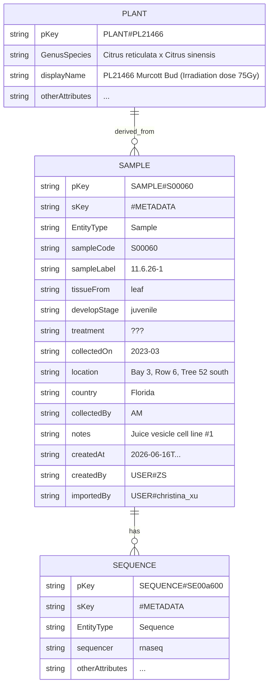

## load sample to DDB
there are about 600 samples including 10 of them without sample id or name.
- sample is the main entry of this database, it is the top of tree
- sample can only link to one plant; one plant can have many samples; 
- one sample can belong to multi projects, and one project can have many sample
- one sample can have multisequence data; but sequence data can only link to one sample
- one plant can has multi-phenotype; one phenotyp item can be used by many plant

## diagram





## item example
```
{
  "pKey": "SAMPLE#S00060",
  "sKey": "#METADATA",
  "EntityType": "Sample",
  "sampleCode": "S00060",
  "sampleLabel":"11.6.26-1",
  "tissueFrom": "leaf",
  "developStage": "juvenile"
  "treatment": "???",
  "collectedOn": "2023-03",
  "location": "Bay 3, Row 6, Tree 52 south"
  "country":"Florida",
  "collectedBy":"AM",
  "notes": "Juice vesicle cell line #1"
  "createdAt": "2026-06-16T...",
  "createdBy": "USER#ZS",
  "importedBy": "USER#christina_xu"
}
```

## links
- Sample → plant Link
 ```
  {
    "pKey": "SAMPLE#S00060",
    "sKey": "PLANT#PL21466",
    "EntityType": "SamplePlant",
    "displayName": "PL21466 Murcott Bud (Irradiation dose 75Gy)",  //denormalization
    "createdAt": "2026-06-16T...",
    "createdBy": "USER#christina_xu"
  }
 ```
- Sample -> sequence Data

```
  {
    "pKey": "SAMPLE#S00060",
    "sKey": "SEQUENCE#SE00a600",
    "EntityType": "SampleSequence",
    "sequencer": "rnaseq",  //denormalization
    "createdAt": "2026-06-16T...",
    "createdBy": "USER#christina_xu"
  }

```

