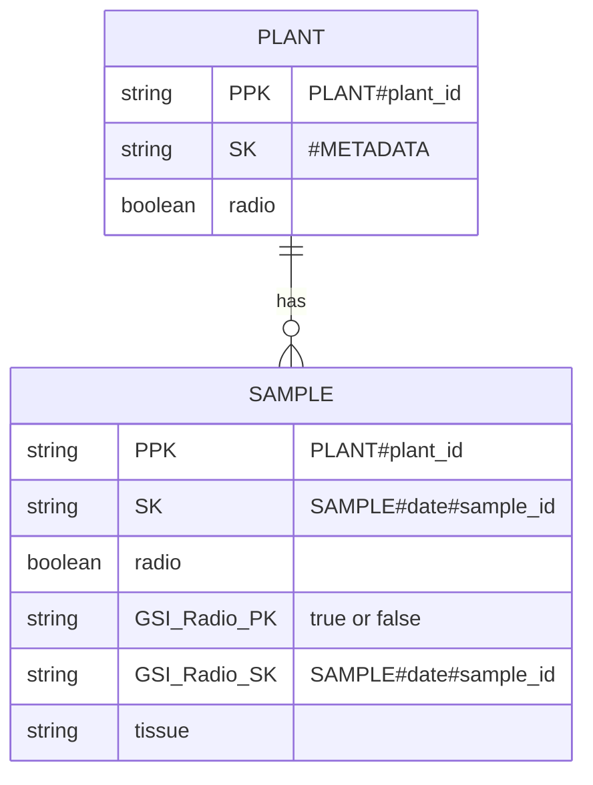
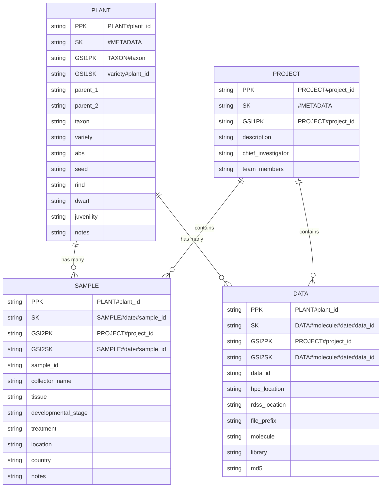

- composite keys, sort keys, and item types.
- Partition Key (PK) and Sort Key (SK) must be defined when create table. other attribute no need defined, can change at any time.
- GSI = Global Secondary Index: "Copy these attributes into a new index and use them as keys"
- The main table uses PK + SK.
- You can have up to 20 GSIs per table.
    - eg. Add radio to the Plant item (as we discussed before).
    - Denormalize (copy) the radio value into every Sample item that belongs to that plant.
    - Add two new attributes in Sample items for the GSI:
      ```
        // Sample Item Example
        {
          "PK": "PLANT#P123",
          "SK": "SAMPLE#2025-06-10#S456",
          
          "radio": true,                    // ← copied from Plant
          
          "GSI_Radio_PK": true,             // ← GSI Partition Key
          "GSI_Radio_SK": "SAMPLE#2025-06-10#S456",   // ← GSI Sort Key (for sorting)
          
          "tissue": "tissueAA",
          ...
        }
      // query by python
      response = table.query(
            IndexName="GSI_Radio",
            KeyConditionExpression="#radio = :r",
            ExpressionAttributeNames={"#radio": "GSI_Radio_PK"},
            ExpressionAttributeValues={":r": True}
        )
      ```


## design

